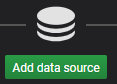
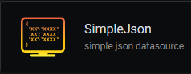

## Docker solution for IoTDB-Grafana Monitoring

This Dockerfile can be used to start a Docker container with a IoTDB server and a Grafana instance connected to it.

## Setup

1. Launch the `start.bat` to create the image and start the container
2. Open your browser and go to http://localhost:3000 to connect to Grafana
3. Use following credentials:
   - Username :`admin`
   - Password: `admin`
4. Grafana will then prompt you to change the password to a new one
5. To add IoTDB click on  
6.  Select the `SimpleJson` DataSource type  

7. Enter a **Name** for your DataSource and the URL (default is http://127.0.0.1:8880)   

8. Click on  and you should get a confirmation that the DataSource is working

9. You can download the RELEASE version of [IoTDB](http://iotdb.apache.org/Download/) to interact with IoTDB using CLI

## Properties

To edit properties of the Database, edit the `iotdb-engine.properties` file before executing `start.bat`. In this file, you can change the default TTL for timeseries, set their precision ( ms, us, ns) .

### `Start.bat`

```shell
docker run -it -p 3000:3000 -p 6667:6667 ....
```

The batch-file can be modified to change port bindings. To do so, change the port number before the `:` to the desired host port

- `3000`: Grafana Server port
- `6667`: IoTDB Server port

```shell
-v C:/IoTDB/data:/opt/incubator-iotdb/server/target/iotdb-server-0.10.0-SNAPSHOT/data
-v C:/IoTDB/logs:/opt/incubator-iotdb/server/target/iotdb-server-0.10.0-SNAPSHOT/logs iotdb
```

The `-v` option is used to bind volumes from the container. This allows the Database to be persistent if the container is shut down. The default location on the host machine is set to `C:/IoTDB/data` and `C:/IoTDB/logs`. These values can be modified to change the location of the Database's data on the host machine.

